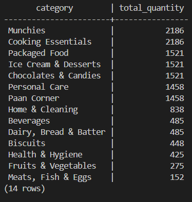
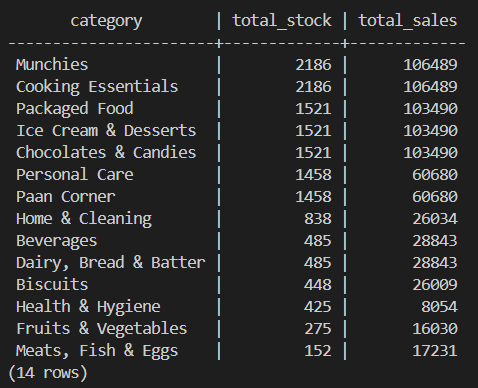
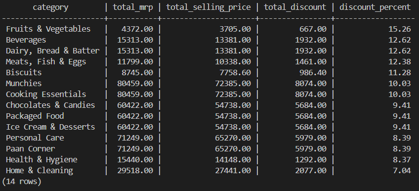
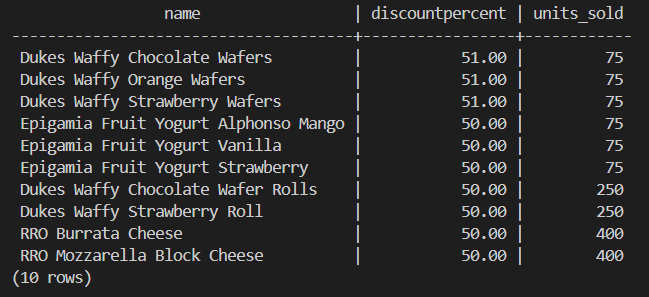
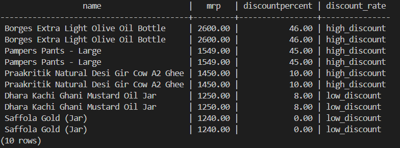
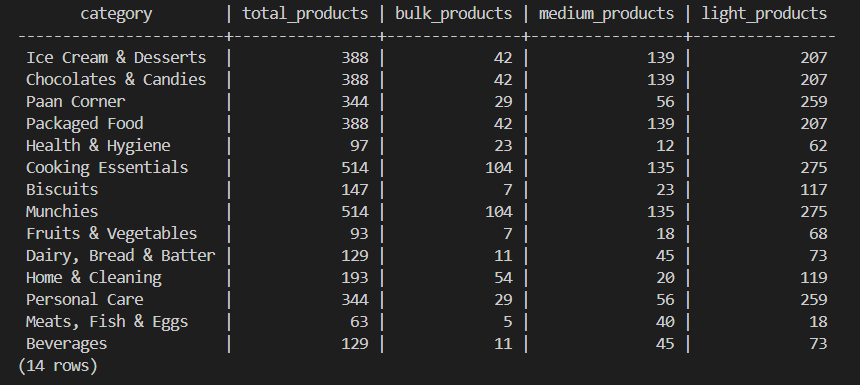
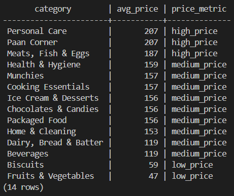
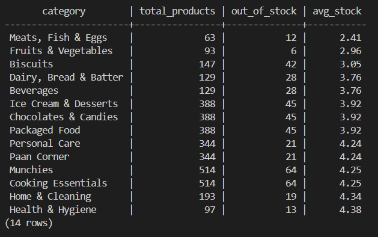

#  Consumer Product Sales And Business Analytics | SQL (PostgreSQL)

##  Overview

This project delivers a structured **Sales And Inventory Analysis** using SQL in PostgreSQL, with a focus on extracting actionable insights that inform **Pricing Strategy, Revenue Optimization and Inventory Efficiency**.

The analysis is designed to reflect real-world analytical workflows used in data-driven organizations—transforming raw transactional data into clear, decision-oriented outputs.

---

##  Scope of Analysis

* Revenue performance across product categories and individual SKUs
* Pricing and discount strategy evaluation
* Inventory utilization and stock risk identification
* Product-level and category-level performance benchmarking
* Detection of inefficiencies in sales and discounting

---

##  Dataset

The dataset consists of product-level transactional and inventory attributes:

| Column Name              | Description             |
| ------------------------ | ----------------------- |
| `category`               | Product category        |
| `name`                   | Product identifier      |
| `mrp`                    | Maximum Retail Price    |
| `discountPercent`        | Applied discount (%)    |
| `availableQuantity`      | Current inventory level |
| `discountedSellingPrice` | Final selling price     |
| `weightInGms`            | Product weight          |
| `outOfStock`             | Stock availability flag |
| `quantity`               | Units sold              |

---

##  Project Structure

```
sales_analysis/
│
├── data/
│   └── zepto_v2.csv
│
├── sql/
│   ├── create_table.sql
│   ├── load_data.sql
│   ├── data_cleaning.sql
│   ├── data_exploration.sql
│   ├── data_analysis.sql
│
├── query_results/
│   ├── categories_and_their_revenue_potential.png
│   ├── categories_and_their_stock_status.png
│   ├── categories_discount_rate.png
│   ├── categories_dominating_inventory.png
│   ├── categories_having_most_outofstock_products.png
│   ├── categories_with_best_discount_percent.png
│   ├── categories_with_highest_stock_and_lowest_sales.png
│   ├── grouping_products_into_weight_categories.png
│   ├── price_after_discount_of_most_expensive_products.png
│   ├── price_metric_of_categories.png
│   ├── products_having_highest_mrp_and_their_discountrate.png
│   ├── products_with_high_discount_low_sales.png
│   ├── products_with_highest_dicount.png
│   ├── stock_distribution.png
│   ├── top_ten_most_expensive_products.png
│   ├── total_inventory_weight_per_category.png
│   ├── total_revenue_loss_due_to_discount.png
|
├── README.md
├── LICENSE
```

---
## Installation & Setup (PostgreSQL)

Follow these steps to set up and run the project locally:

### 1. Clone the Repository

```bash id="put_your_bash_id_here"
git clone https://github.com/Dreamy100/SQL-Consumer-Product-Sales-Analysis.git
cd consumer-product-sales-analysis
```

---

### 2. Install PostgreSQL

Download and install PostgreSQL from the official website:
https://www.postgresql.org/download/

Ensure `psql` is added to your system PATH.

---

### 3. Create a Database

Open your terminal or SQL client (e.g., pgAdmin / DBeaver) and run:

```sql id="put_your_id_here"
CREATE DATABASE consumer_sales_db;
```

---

### 4. Import the Dataset

Navigate to your project folder and load the dataset:

```bash id="put_your_bash_id_here"
psql -U your_username -d consumer_sales_db -f data/schema.sql
psql -U your_username -d consumer_sales_db -f data/data.sql
```

> Alternatively, you can manually import CSV files using pgAdmin or DBeaver.

---

### 5. Run SQL Queries

Open your SQL editor and execute the queries from:

```id="your_psql_id_here"
queries/
```

These queries perform data cleaning, transformation, and exploratory data analysis.

---

## Project Setup Notes

* All SQL scripts are modular and organized by purpose (schema, data loading, analysis)
* The dataset is stored inside the `data/` folder
* Compatible with PostgreSQL 12+
* Can be run using tools like pgAdmin, DBeaver, or VS Code with SQL extensions
---

##  Methodology

### Data Exploration & Validation

* Initial dataset inspection and schema understanding
* Validation of derived pricing fields (discount vs final price consistency)
* Identification of distribution patterns across categories and pricing

### Tools used

* PostgreSQL for querying and analysis
* VS Code for writing and structuring SQL

### SQL Techniques Applied

* Aggregations (`SUM`, `AVG`, `MIN`, `MAX`)
* Grouped analysis (`GROUP BY`)
* Derived metrics and calculations
* Common Table Expressions (CTEs) for modular query design
* Multi-level sorting for prioritization and insight extraction

---

##  Key Metrics

* **Revenue** = `discountedSellingPrice × quantity`
* **Discount Impact** = `(mrp - discountedSellingPrice) × quantity`
* **Inventory Volume** = `SUM(availableQuantity)`
* **Sales Volume** = `SUM(quantity)`

---

## Analysis and Insights

---

### Revenue Contribution by Category


#### Key Insights
- **Top revenue drivers:** Packaged Food, Chocolates & Candies, Ice Cream & Desserts (~₹17.3M each)  
- **Mid-tier:** Munchies & Cooking Essentials (~₹13.6M), Paan Corner & Personal Care (~₹12.6M)  
- **Low performers:** Fruits & Vegetables (~₹0.44M), Health & Hygiene (~₹1.5M)  

---

### Revenue Loss Due to Discounts


#### Key Insights
- **Highest loss:** Ice Cream & Desserts, Chocolates & Candies, Packaged Food (~₹1.67M each)  
- **Significant losses:** Cooking Essentials & Munchies (~₹1.49M), Paan Corner & Personal Care (~₹1.05M)  
- **Minimal impact:** Fruits & Vegetables (~₹82K), Biscuits (~₹200K)  

---

### Inventory Distribution by Category



#### Key Insights
- **Highest inventory:** Munchies & Cooking Essentials (2186 units each)  
- **Strong presence:** Packaged Food, Ice Cream & Desserts, Chocolates & Candies (1521 units)  
- **Lowest inventory:** Meats, Fish & Eggs (152), Fruits & Vegetables (275)  

---

### High Stock vs Low Sales



#### Key Insights
- **Overstock risk:** Munchies & Cooking Essentials have highest stock but not proportional sales  
- **Inefficiency:** Personal Care & Paan Corner → high stock with lower sales  
- **Weak demand:** Health & Hygiene → low sales despite available stock  

---

### Discount Strategy by Category



#### Key Insights
- **High discounts:** Fruits & Vegetables (15.46%), Meats (~11%), Packaged categories (~8%)  
- **Low discounts:** Cooking Essentials, Munchies, Dairy (~7%)  
- **Mismatch:** High discounts not consistently driving higher sales  

---

### High Discount but Low Sales Products



#### Key Insights
- Products with **50–51% discount still show low sales (~75 units)**  
- Indicates **discounting alone is ineffective** for demand generation  

---

### High-Value Products & Discount Strategy



#### Key Insights
- Premium items receive **heavy discounts (~45%)**  
- Some high-MRP products have **no discount**  
- Shows **inconsistent pricing strategy**  

---

### Product Segmentation by Weight



#### Key Insights
- Majority of products are **light-weight**  
- **Munchies & Cooking Essentials** dominate across all segments  
- Limited bulk products → focus on fast-moving items  

---

### Pricing Profile by Category



#### Key Insights
- **High-price categories:** Personal Care, Paan Corner, Meats  
- **Most categories:** fall in **mid-price range (~₹119–₹159)**  
- **Lowest:** Fruits & Vegetables, Biscuits  

---

### Stock Availability & Out-of-Stock Analysis



#### Key Insights
- **Highest stockouts:** Munchies & Cooking Essentials (64 each)  
- **Frequent issues:** Packaged Food, Ice Cream, Chocolates (~45)  
- **Low stock pressure:** Fruits & Vegetables, Meats  

---

## Overall Business Insight

- The business is **heavily driven by packaged and processed categories**, which dominate both revenue and inventory  
- There is a clear **inventory imbalance**, with certain categories overstocked while not generating proportional sales  
- The company is facing **significant revenue leakage due to aggressive discounting**, especially in top-performing categories  
- **Discount strategies are inefficient**, as high discounts are not consistently translating into higher sales  
- Pricing across products is **inconsistent**, particularly among high-value items  
- Frequent **stockouts in high-demand categories** indicate supply chain inefficiencies  

---

## Final Conclusion

> The business suffers from **inefficient inventory allocation and ineffective discount strategies**, leading to **lost revenue and missed sales opportunities**, despite strong demand in key categories.

---

## Remarks

### This project demonstrates a structured approach to analytical problem-solving using SQL, with emphasis on:
* Translating business questions into data queries
* Building clear, maintainable analytical workflows
* Generating insights that directly support decision-making

---

## License

This project is licensed under the terms of the LICENSE file included in this repository
